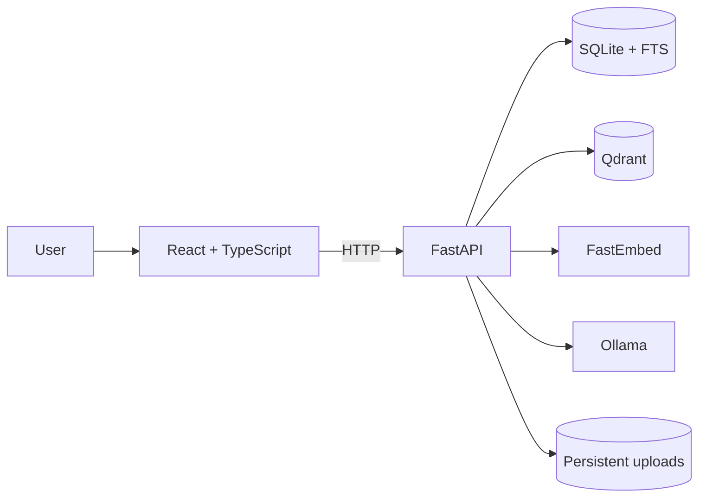

# AI Document Search Platform

[](https://github.com/baubekTns/rag-document-search/actions/workflows/backend-tests.yml)

Upload PDFs, search their contents, and ask grounded questions with page-aware citations. The application is a local-first retrieval-augmented generation (RAG) workspace: it combines SQLite full-text search with vector retrieval, reranks the combined candidates, and asks Ollama to answer only when the retrieved context meets an answer-quality threshold.

## Stack

- **Frontend:** React and TypeScript
- **API:** FastAPI
- **Keyword search and metadata:** SQLite FTS
- **Embeddings:** FastEmbed
- **Vector search:** Qdrant
- **Local LLM:** Ollama
- **Runtime:** Docker Compose

## What is implemented

- PDF upload validation for filename, content type, signature, and configured size limit
- Recoverable staged ingestion with SQLite transactions and Qdrant/file cleanup on failure
- Hybrid keyword and vector retrieval with reranking
- Search and Q&A across all documents or one selected document
- Page-aware search results and answer citations
- Answer-quality refusal when context is missing or too weak
- Accessible React workspace with loading, error, retry, and cancellation feedback

## Architecture



## Ingestion and recovery

1. The API streams an upload to a staging file, stopping when the size limit is exceeded.
2. It verifies PDF metadata and signature, extracts page text, chunks it with page ranges, and creates embeddings.
3. A SQLite transaction stores the document, chunks, FTS entries, and embedding metadata; Qdrant receives vectors tagged with the document ID.
4. The staged file is promoted and the document becomes `ready` only after successful persistence.
5. If a stage fails, SQLite rolls back where applicable and idempotent cleanup removes staged/final files, vector records, and database records. A reconciliation utility can report stuck or orphaned state.

## Repository layout

```text
backend/
  app/api/            FastAPI routes
  app/core/           settings, database, logging, errors
  app/schemas/        request and response models
  app/services/       ingestion, retrieval, Q&A, providers, health
  tests/              focused backend unit tests
frontend/
  src/components/     presentational workspace components
  src/features/       upload, search, and Q&A hooks
  src/services/       typed API boundary
  src/test/           frontend test setup
.github/workflows/    CI
docker-compose.yml    local multi-container runtime
.env.example          safe local configuration defaults
```

## Quick start with Docker Compose

Prerequisites: Docker Desktop (with Compose), and [Ollama](https://ollama.com/) running on the host. Install the configured model once:

```bash
ollama pull llama3.2:3b
cp .env.example .env
docker compose up --build
```

Open <http://localhost:5173>. The API is at <http://localhost:8000>; interactive API documentation is at <http://localhost:8000/docs>.

Useful lifecycle commands:

```bash
docker compose ps
docker compose logs -f backend
docker compose down
```

The Compose setup is intended for local development and mounts source directories for hot reload.

## Configuration

Copy `.env.example` to `.env` for Docker Compose. The defaults below are the complete supported local configuration surface.

| Variable | Default | Purpose |
| --- | --- | --- |
| `QDRANT_URL` | `http://qdrant:6333` | Qdrant endpoint in Compose |
| `QDRANT_COLLECTION_NAME` | `document_chunks` | Vector collection |
| `QDRANT_TIMEOUT_SECONDS` | `10` | Qdrant client timeout |
| `SQLITE_DATABASE_PATH` | `data/documents.db` | SQLite path for direct backend runs |
| `UPLOAD_DIRECTORY` | `uploads` | Final uploaded-PDF directory |
| `UPLOAD_STAGING_DIRECTORY` | `uploads/.staging` | Temporary upload directory |
| `MAX_UPLOAD_SIZE_BYTES` | `10485760` | Upload limit (10 MiB) |
| `UPLOAD_STREAM_CHUNK_SIZE` | `65536` | Upload streaming chunk size |
| `INGESTION_CONCURRENCY` | `2` | Maximum simultaneous ingestions |
| `EMBEDDING_CONCURRENCY` | `1` | Maximum embedding operations |
| `CORS_ORIGINS` | `http://localhost:5173` | Comma-separated permitted origins |
| `EMBEDDING_MODEL_NAME` | `sentence-transformers/all-MiniLM-L6-v2` | FastEmbed model |
| `OLLAMA_BASE_URL` | `http://host.docker.internal:11434` | Ollama API base URL |
| `OLLAMA_MODEL` | `llama3.2:3b` | Ollama model |
| `OLLAMA_TIMEOUT_SECONDS` | `120` | Ollama request timeout |
| `OLLAMA_MAX_OUTPUT_TOKENS` | `512` | Maximum generated tokens |
| `OLLAMA_MAX_RETRIES` | `1` | Retries for transient Ollama failures |
| `READINESS_TIMEOUT_SECONDS` | `2` | Dependency-check timeout |
| `BACKEND_PORT` | `8000` | Host backend port |
| `FRONTEND_PORT` | `5173` | Host frontend port |
| `QDRANT_PORT` | `6333` | Host Qdrant port |
| `VITE_API_URL` | `http://localhost:8000` | Browser-reachable API URL for Vite |

Compose intentionally maps its SQLite and upload paths to `/app/data` and `/app/uploads`, backed by named volumes. `VITE_API_URL` must be reachable from the browser, not merely from another container.

## Using the workspace

1. In **Document library**, upload a PDF. Processing feedback reports validation or ingestion outcomes.
2. Leave the scope set to **All documents** (the default), or choose a document to constrain both search and Q&A to that PDF.
3. Use **Search** for retrievable passages and their page information.
4. Use **Q&A** for a grounded answer. Earlier conversation and results remain visible during a refresh.
5. Expand an answer’s citations to read its source preview and optional technical scores/identifiers. Citation markers are checked against the supplied retrieval context; this validates references, not the factual correctness of the answer.

## Local development

For the most reliable local environment, use Compose above. To run the frontend separately against a backend at port 8000:

```bash
cd frontend
npm ci
VITE_API_URL=http://localhost:8000 npm run dev
```

For a direct backend run, use Python 3.12, make Qdrant available at `http://localhost:6333`, and run Ollama locally:

```bash
cd backend
python3.12 -m venv .venv
source .venv/bin/activate
python -m pip install -r requirements.txt
QDRANT_URL=http://localhost:6333 OLLAMA_BASE_URL=http://localhost:11434 uvicorn app.main:app --reload
```

## Verification

Backend:

```bash
docker compose run --rm --no-deps backend python -m pytest -q
```

Frontend:

```bash
cd frontend
npm ci
npm test
npm run lint
npm run build
```

Compose configuration:

```bash
docker compose config --quiet
```

GitHub Actions runs these backend/frontend checks in separate jobs, caches pip and npm dependencies, and validates the Compose configuration.

## Health endpoints

- `GET /health/live` — liveness only; does not contact Qdrant or Ollama.
- `GET /health/ready` — checks SQLite, Qdrant, and Ollama with short timeouts. Returns `200` when all are available and `503` otherwise.

For example:

```bash
curl http://localhost:8000/health/live
curl -i http://localhost:8000/health/ready
```

## Persistence and reset

Named Compose volumes preserve SQLite metadata, uploaded PDFs, and Qdrant vectors across container recreation. `docker compose down` stops containers without deleting that data.

To intentionally erase all local Compose state (including the frontend dependency volume), run:

```bash
docker compose down --volumes
```

This is destructive and cannot be undone.

## Troubleshooting

| Symptom | Check |
| --- | --- |
| Readiness is `503` because Qdrant is unavailable | Run `docker compose ps`; Qdrant must be healthy before the backend starts. |
| Readiness is `503` because Ollama is unavailable | Start Ollama and run `ollama pull llama3.2:3b`; verify `OLLAMA_BASE_URL`. On Linux Docker hosts, configure a host-reachable Ollama address rather than relying on `host.docker.internal`. |
| Upload/answer triggers a model error | Confirm the configured `EMBEDDING_MODEL_NAME` can be downloaded and `OLLAMA_MODEL` exists locally. The first embedding use may download the FastEmbed model. |
| Browser cannot reach the API | Set `VITE_API_URL` to the browser-reachable backend URL, restart Vite/Compose, and include the frontend origin in `CORS_ORIGINS`. |
| Documents or vectors appear missing after restart | Do not use `docker compose down --volumes`; inspect `docker compose ps` and the persistent-volume configuration. |

## Limitations

This is a portfolio-scale, local-first application, not a production deployment. It has no authentication, multi-user isolation, OCR for scanned PDFs, asynchronous job queue, streaming answers, backup strategy, or production observability stack. It depends on a locally reachable Ollama instance and on model availability. Treat uploaded documents and generated answers accordingly.

## License

MIT License
